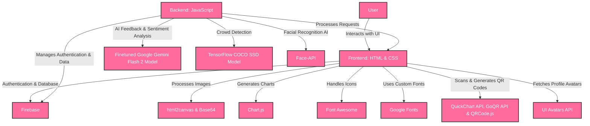

# **Tourly.ai**

**Manage your tourist site smartly!**  

**Tourly.ai** is an advanced **AI-driven tourism management platform** that helps site owners **optimize operations, prevent overcrowding, and enhance visitor experiences** through intelligent automation and tools.

## 🚀 **Demo**

[Live Demo >](https://tourly-ai.web.app/)

> **Note:** API keys and database credentials have been omitted from the codebase for security reasons. Use the demo link above to explore the features.

---

## 🎯 **Problem Statement**  

Managing tourism sites efficiently is a challenge. **Overcrowding, pricing inefficiencies, cost management, fraud prevention, workforce allocation, visitor feedback collection and its analysis** are common issues that impact **visitor experience and revenue**. Traditional management methods lack **real-time analytics, automation and site management tools**, leading to **losses and operational inefficiencies**.  

Tourly.ai **leverages AI to solve these challenges, ensuring a seamless and profitable site management experience**.

---

## 💡 **Solution**  

**Tourly.ai** offers a **complete AI-powered solution** for **tourism site management**, integrating:  

✔ **AI-based headcount tracking** for real-time crowd monitoring  
✔ **Dynamic pricing automation** to maximize revenue based on visitor flow  
✔ **AI-driven ticketing** with fraud prevention & facial recognition  
✔ **Smart cost tracking** for financial optimization  
✔ **AI-powered feedback analysis** to improve visitor satisfaction  
✔ **Workforce shifts scheduling tool** to optimize staffing and reducing costs

---

## ✨ **Key Features**  

### **1️⃣ AI-Based Crowd Management**  
> **Leverage the power of artificial intelligence to monitor and manage visitor flow in real-time, ensuring optimal experiences and preventing overcrowding.**  

✅ **Real-time headcount using AI-powered computer vision**  

✅ **Displays current visitors, tickets sold, and capacity percentage**  

✅ **Prevents overcrowding & optimizes visitor flow**  

---

### **2️⃣ Dynamic Pricing Management**  
> **Maximize revenue and optimize visitor distribution with our intelligent dynamic pricing system that automatically adjusts based on real-time demand.**  

✅ **AI automatically adjusts ticket prices based on visitor count**  

✅ **Customizable pricing formulas with dynamic price limits**  

✅ **Real-time pricing graphs & simulations**  

---

### **3️⃣ AI-Powered Ticket Management**  
> **Streamline your ticketing process with advanced AI technology that ensures security, prevents fraud, and enhances the visitor experience.**  

✅ **Generate & verify tickets using facial recognition & QR codes**  

✅ **AI helps detect duplicate or fraudulent tickets**  

✅ **Easy visitor photo capture & digital ticketing system**  

---

### **4️⃣ Cost Management & Expense Analysis**  
> **Gain complete visibility into your operational costs with powerful analytics tools that help identify trends and optimize spending.**  

✅ **Tracks total expenses, top cost categories, and trends**  

✅ **Interactive expense analysis graphs**  

✅ **Allows managers to add & categorize costs**  

---

### **5️⃣ Worker Shift Management**  
> **Optimize your workforce allocation with intelligent scheduling tool that ensures proper coverage during peak times and reduces manpower costs during slower periods.**  

✅ **Assign & schedule worker shifts dynamically**  

✅ **Tracks total workers, today's shifts, and coverage rate**  

✅ **Efficiently utilizes the manpower and reduces salary costs**  

---

### **6️⃣ AI-Powered Feedback Analysis**  
> **Transform visitor feedback into actionable insights with our advanced AI analysis tools that identify patterns and improvement opportunities.**  

✅ **Managers can create, share, and manage feedback forms**

✅ **Automatically sorts feedback as Positive, Neutral, or Negative**  

✅ **AI identifies common visitor concerns & improvement areas**  

✅ **Sentiment charts, rating distributions, and trend analysis**  

---

### **7️⃣ Sleek & Modern UI Design**  
> **A beautifully designed interface for an intuitive user experience.**  

✅ **Minimalist, professional design with a pink & white theme**  

✅ **Sidebar navigation for easy access to all features**  

✅ **Interactive charts, cards, and real-time data updates**  

---

## 🛠️ **Technology Stack**  

- **Frontend**: HTML and CSS

- **Backend**: JavaScript

- **Database & Authentication**: Firebase

- **Image Processing**: html2canvas and Base64

- **Graphs & Charts**: Chart.js

- **Icons & Fonts**: Font Awesome and Google Fonts

- **QR Code Processing**: QuickChart API, GoQR API and QRCode.js

- **Profile Avatars**: UI Avatars API

- **AI-Powered Feedback & Sentiment Analysis**: Finetuned Google Gemini Flash 2 Model

- **AI-Based Crowd Detection**: TensorFlow COCO SSD Model

- **AI Facial Recognition**: Face-API

---

## 📋 **Impact & Benefits**  

- **Smarter Crowds, Happier Visitors:** AI-powered crowd management prevents congestion, creating a seamless and enjoyable experience for every visitor.

- **Revenue Optimization Made Easy:** Dynamic pricing ensures fair and profitable ticketing, balancing demand and maximizing earnings.

- **Frictionless & Secure Entry:** AI-backed ticket verification eliminates fraud, making check-ins faster and more reliable.

- **Efficient Workforce, Lower Costs:** Intelligent shift management allocates staff efficiently, reducing unnecessary labor costs.

- **Actionable Insights from Every Review:** AI-driven feedback analysis turns visitor opinions into real improvements, leading to higher satisfaction and better services.

- **Better Budgeting, Smarter Spending:** Cost management tools track expenses, identify trends, and optimize financial decisions for sustainable operations.

---

## Getting Started 🚀

### Requirements:
- A modern web browser with JavaScript enabled.
- Stable internet connection for loading media and syncing data.

### Steps:
1. Open the app in your browser.
2. Log in or Sign up on the account page.
3. Start managing your tourist site smartly with Tourly.ai!

---

## 🤝 **Contributing**  

Contributions are always welcome! Please follow these steps:

1. Fork the repository.  
2. Create a new branch (`git checkout -b feature/your-feature`).  
3. Commit your changes (`git commit -m 'Add your message'`).  
4. Push to the branch (`git push origin feature/your-feature`).  
5. Open a pull request.  

---

Built with ❤️ to make tourist site management smarter and more efficient with AI.
